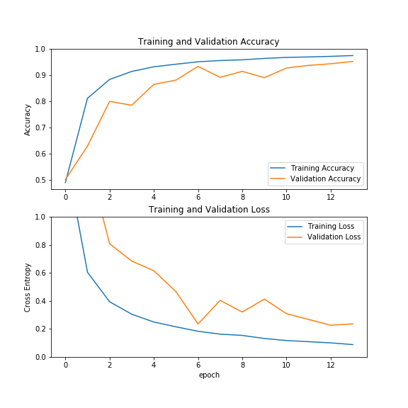
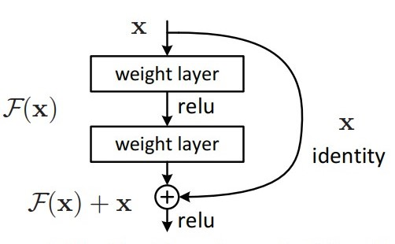

# COMP 551 Mini-Project 3: Modified MNIST, State-of-the-art exploration
- **Goal**: Detect numerically largest digit in the image.  

## Our paper: 
- https://www.overleaf.com/5792449574grsgjxdvsbfw

## Announcements: 
- Our group on MyCourses is **Group 9**, please join ASAP 
- Once the above is done, please join the Kaggle competition on **Group 9**
- If we collect sources along the way, please make sure you write document them down in the **literature** folder.
- As possible,use **branching** whenever
- When a task is done, please put **done** next to it, but please don't delete the whole task until 2 days later so we can all know how progress is going. 
- We will use **Google Colab** to train our models. Notw you can have two notebooks open at the same time. 
- **Models to try**: 
  - Xception 
  - VGG16 
  - InceptionV3
  - InceptionResNetV2	 
  - DenseNet201
  - NASNetLarge
  - ResNet152V2

## Best Performing model so far: 
- **Resnet50V2, no pre-trained parameters, 14+2 epochs, Dropout 0.6, val_acc = 0.9700, Kaggle acc: 0.96766**

- Resnet residual learning building block: 

- Model architecture: 

- References: 
  - **Deep Residual Learning for Image Recognition** https://arxiv.org/pdf/1512.03385.pdf
  - **Identity Mappings in Deep Residual Networks** https://arxiv.org/pdf/1603.05027.pdf
  

